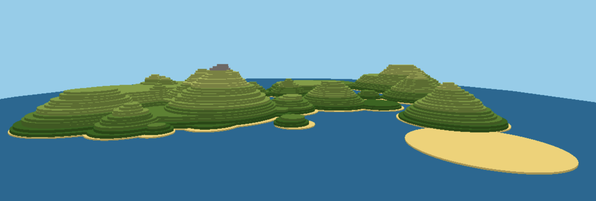

# archipelago

archipelago is a landscape generator written in javascript using three.js.

https://warm-escarpment-84694.herokuapp.com

Use the arrow keys to move up and down, and rotate the view left or right

Press w to move forward

**Credits**

Design and code: Petar Simonovic

Font: Squada One designed by Joe Prince

**Version 1.0**
